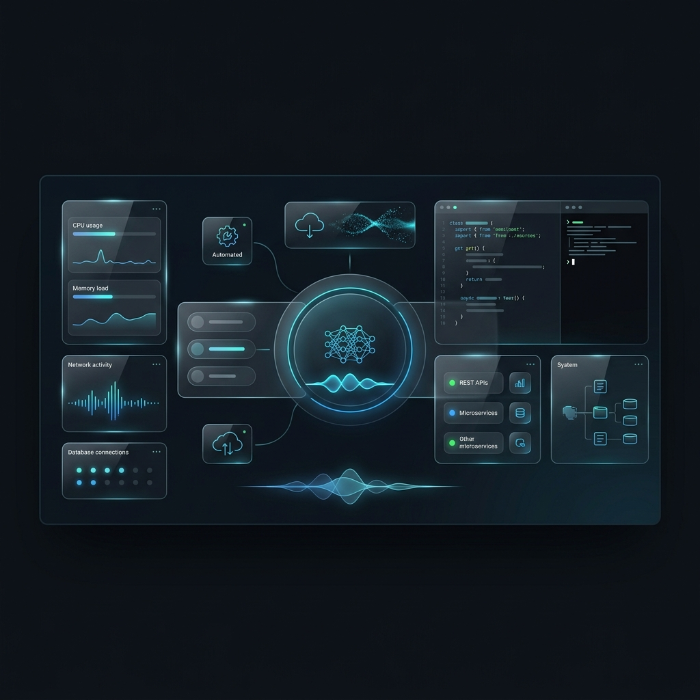

<div align="center">
  <a href="https://github.com/BernardAbraham27">
    <picture>
      <source media="(prefers-color-scheme: dark)" srcset="./assets/banner.svg">
      <source media="(prefers-color-scheme: light)" srcset="./assets/banner.svg">
      
    </picture>
  </a>
</div>

<br>

<div align="center">
  <a href="https://github.com/BernardAbraham27">
    
  </a>
  <a href="https://github.com/BernardAbraham27?tab=followers">
    
  </a>
  <a href="https://github.com/BernardAbraham27?tab=stars">
    
  </a>
</div>

<br>

<div align="center">
  
</div>

<div align="center">
  
</div>

## 🚀 Technology Stack

<div align="center">
  <table>
    <tr>
      <td align="center" width="20%">
        <b>Frontend</b><br><br>
        
      </td>
      <td align="center" width="20%">
        <b>Backend</b><br><br>
        
      </td>
      <td align="center" width="20%">
        <b>Mobile</b><br><br>
        
      </td>
      <td align="center" width="20%">
        <b>Database</b><br><br>
        
      </td>
      <td align="center" width="20%">
        <b>Tools & Cloud</b><br><br>
        
      </td>
    </tr>
  </table>
</div>

<div align="center">
  
</div>

## 💻 Featured Projects

<table align="center">
  <tr>
    <td width="50%" valign="top">
      <h3 align="center">🤖 Friday AI Assistant</h3>
      <div align="center">
        <a href="https://github.com/BernardAbraham27/Friday-AI">
          
        </a>
        <br><br>
        <p>AI-powered desktop assistant built with Electron and Ollama, seamlessly integrating local LLMs into daily workflows.</p>
        <p><i>C# • Electron • Ollama • React</i></p>
        <a href="https://github.com/BernardAbraham27/Friday-AI">
          
        </a>
        <br><br>
        <b>[ 🚧 Active Development ]</b>
      </div>
    </td>
    <td width="50%" valign="top">
      <h3 align="center">💰 Expense Management</h3>
      <div align="center">
        <a href="https://github.com/BernardAbraham27">
          
        </a>
        <br><br>
        <p>Enterprise-grade financial tracking system with rich real-time analytics and role-based access control.</p>
        <p><i>ASP.NET Core • PostgreSQL • React</i></p>
        <a href="https://github.com/BernardAbraham27">
          
        </a>
        <br><br>
        <b>[ ✅ Completed ]</b>
      </div>
    </td>
  </tr>
  <tr>
    <td width="50%" valign="top">
      <h3 align="center">🎫 Enterprise ITSM</h3>
      <div align="center">
        <a href="https://github.com/BernardAbraham27">
          
        </a>
        <br><br>
        <p>Scalable IT Service Management platform handling tickets, SLA tracking, and internal asset management.</p>
        <p><i>.NET • SQL Server • TypeScript</i></p>
        <a href="https://github.com/BernardAbraham27">
          
        </a>
        <br><br>
        <b>[ ⚙️ Maintenance ]</b>
      </div>
    </td>
    <td width="50%" valign="top">
      <h3 align="center">📱 Flutter Applications</h3>
      <div align="center">
        <a href="https://github.com/BernardAbraham27">
          
        </a>
        <br><br>
        <p>Cross-platform mobile applications delivering native performance, responsive design, and beautiful UIs.</p>
        <p><i>Flutter • Dart • REST APIs</i></p>
        <a href="https://github.com/BernardAbraham27">
          
        </a>
        <br><br>
        <b>[ 🚀 Live ]</b>
      </div>
    </td>
  </tr>
</table>

<div align="center">
  
</div>

## 📈 GitHub Analytics

<div align="center">
  
  
</div>
<br>
<div align="center">
  
  <!-- GitHub Trophy -->
  
</div>

<br>
<div align="center">
  <!-- Contribution Snake (Generated via GitHub Actions) -->
  <picture>
    <source media="(prefers-color-scheme: dark)" srcset="https://raw.githubusercontent.com/BernardAbraham27/BernardAbraham27/output/github-contribution-grid-snake-dark.svg">
    <source media="(prefers-color-scheme: light)" srcset="https://raw.githubusercontent.com/BernardAbraham27/BernardAbraham27/output/github-contribution-grid-snake.svg">
    
  </picture>
</div>

<div align="center">
  
</div>

## 🎯 Current Focus

<div align="center">
  <table>
    <tr>
      <td width="33%" align="center">
        <h3>📚 Learning</h3>
        <p>Deepening knowledge in <b>Docker</b> orchestration and <b>Azure</b> cloud infrastructure to build highly scalable enterprise solutions.</p>
      </td>
      <td width="33%" align="center">
        <h3>🛠️ Building</h3>
        <p>Architecting the <b>Friday AI Assistant</b> to revolutionize desktop workflows by integrating local LLMs with system tools.</p>
      </td>
      <td width="33%" align="center">
        <h3>🚀 Roadmap</h3>
        <p>Transitioning towards a world-class Full Stack Software Engineer role focusing on AI-powered Enterprise Application architecture.</p>
      </td>
    </tr>
  </table>
</div>

<div align="center">
  
</div>

## 🧠 Development Philosophy

```csharp
public class Developer
{
    public string Name { get; set; } = "Bernard Abraham";
    public string Role { get; set; } = "Full Stack Software Engineer";

    public async Task<Result> BuildSolutionAsync(Problem problem)
    {
        var architecture = await DesignCleanArchitectureAsync(problem);
        var code = WriteElegantCode(architecture, quality: Quality.Premium);
        var product = await DeployToCloudAsync(code, new AzureEnvironment());
        
        return new Result
        {
            Status = "Success",
            Impact = "Maximized",
            UserExperience = "Exceptional"
        };
    }
}
```

<div align="center">
  
</div>

## 📫 Let's Connect

<div align="center">
  <a href="https://www.linkedin.com/in/bernard-abraham-517991235/"></a>
  <a href="mailto:bernardabraham.e@gmail.com"></a>
  <a href="YOUR_PORTFOLIO_URL"></a>
  <a href="YOUR_RESUME_URL"></a>
</div>

<br>

<div align="center">
  
</div>
